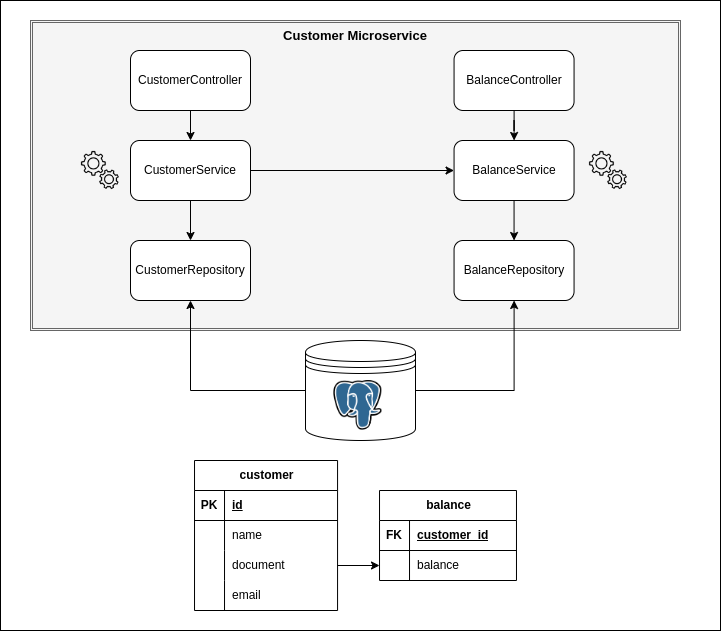

# Customer Microservice - Compra e Venda de CDBs

## Descrição

Este microsserviço faz parte de um projeto Java utilizando o framework Spring Boot para criar um sistema para compra e
venda de CDBs para clientes.
Esta aplicação é responsável por gerenciar dados de clientes, como criação de um novo cliente (_customer_), conta com
saldo (_balance_) e atualização desses dados.

## Tecnologias Utilizadas

- **Java 17**
- **Spring Boot (3.1.5)**
- **Swagger**
- **[Docker](https://docs.docker.com/desktop/)**
- **Gradle**
- **JUnit e Mockito**

## Diagrama

O projeto basicamente segue uma arquitetura de três camadas (Controller, Service, Repository) para garantir a separação
de responsabilidades e a modularidade do código. Aqui está uma breve descrição de cada camada:

- **Controller**: Responsável por lidar com as requisições HTTP, interagir com o serviço apropriado e retornar as
  respostas adequadas.
- **Service**: Contém a lógica de negócios da aplicação, coordenando as operações entre o controlador e o repositório.
- **Repository**: Responsável pela interação direta com o banco de dados, utilizando Spring Data JPA para operações de
  CRUD.

A imagem abaixo representa esquematicamente a comunicação entre as camadas do microsserviço e também a comunicação com o
banco de dados, bem como as tabelas de cliente e conta.



## Configuração

1. Clone o repositório.
2. Certifique-se de ter o Docker instalado em sua máquina.
3. Execute o seguinte comando para criar e iniciar o contêiner PostgreSQL:

```bash
docker-compose -f docker-compose.yml up -d
```

4. Execute a aplicação usando o Gradle: `./gradlew bootRun`.

## Documentação da API

A API é documentada usando o Swagger. Para acessar a documentação, inicie a aplicação e vá
para [http://localhost:8080/swagger-ui.html](http://localhost:8080/swagger-ui.html).

### Endpoints

#### `POST /customer/create`

- Cria um novo cliente. Os dados devem ser enviados no corpo da solicitação.

```json
{
  "name": "novocliente",
  "document": "12345678910",
  "email": "novocliente@mail.com",
  "amount": 0
}
```

#### `GET /customer/get?document=12345678910`

- Retorna um cliente com os dados de sua conta.

#### `POST /balance/update`

- Atualiza o saldo de um cliente. Os dados devem ser enviados no corpo da solicitação.

```json
{
  "customerId": "1234-abcd",
  "balance": 10.0
}
```

### Logs

A aplicação possui logs de ratreamento de todas as transações que são feitas. Ao realizar a compra ou venda de CDBs, um
id no formato _UUID_ é criado para a transação o qual é possível acompanhar em todo o fluxo de compra ou venda.

## Testes

Os testes unitários são implementados usando JUnit e Mockito. Execute os testes usando o comando:

```bash
./gradlew test
```